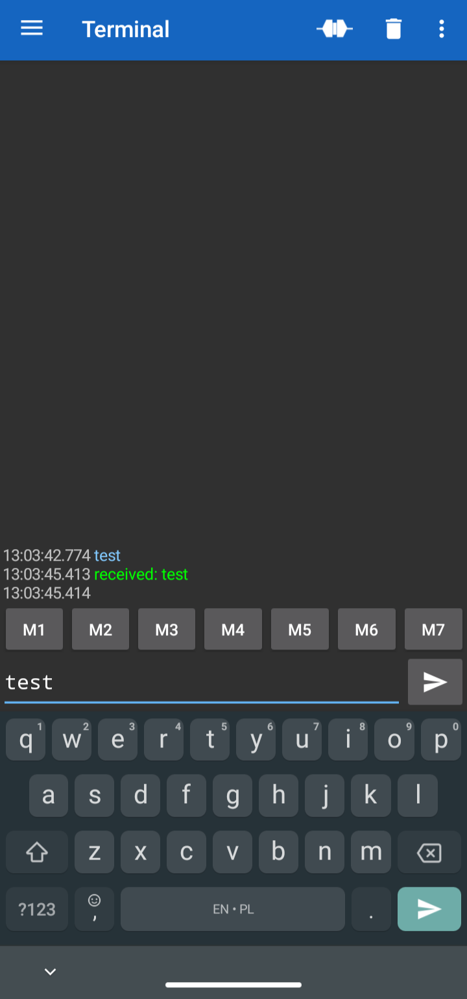

# "UART (Universal Asynchronous Receiver-Transmitter)"

UART jest jednym z najczęściej stosowanych protokołów komunikacyjnych. Stosuje się go m.in.:
- W komunikacji między procesorami
- Do wyprowadzania tzw. "Debugu"
- Do komunikacji z modułami (Bluetooth, GPS, LTE itp.)
  
Poznaliśmy wcześniej **monitor portu szeregowego**. Jest to nic innego, jak właśnie UART. W ten sposób,
wysyłając bajt po bajcie, czytaliśmy wiadomości wysyłane przez mikroprocesor.
  
Więcej na temat komunikacji UART, przeczytasz [tutaj](https://www.analog.com/en/analog-dialogue/articles/uart-a-hardware-communication-protocol.html).
Dla nas, najważniejszy jest sposób podłączenia "na krzyż":


## UART - komunikacja z komputerem
### Czytanie wiadomości UART
W rozdziale GPIO, przy użyciu biblioteki `Serial`, wysyłaliśmy wiadomości do naszego komputera. Korzystając
z tej samej biblioteki, możemy wysyłać wiadomości do mikrokonrolera. Poniższy kod, odbiera bajt po bajcie
wiadomość z naszego portu szeregowego. Działa on w sposób nieblokujący, dzięki użyciu funkcji `serialEvent()`.
Jej zawartość, można przenieść do funkcji `loop()` nie zmieniając działania kodu.
  
**UWAGA!** Monitor portu szeregowego, domyślnie wysyła znak nowej linii po naciśnięciu klawisza "Enter". 
Jest to znak `\n` który przez systemy operacyjne interpretowany jest jako nowa linia. Z tego powodu, zobaczysz "dziwną"
przerwę po ostatnim "received:".

```C
#include "Arduino.h"

void setup()
{
    Serial.begin(115200);
}

void serialEvent(){
  if (Serial.available() > 0) {
    char character = Serial.read();
    Serial.print("received: ");
    Serial.println(character);
  }
}

void loop()
{

}

```
Zazwyczaj, interesuje nas jednak reakcja kodu na całą komendę, a nie pojedynczy znak (choć nie zawsze).
Biblioteka `String.h`, pozwala na operacje na ciągach znaków w bardzo intuicyjny sposób. Spróbuj:
- Utworzyć zmienną globalną typu `String` o nazwie `inputString`
- Dodawać do niej każdy odebrany bajt (tip. `a += 1` to to samo co `a = a + 1`)
- Jeżeli bajt jest równy (`==`) znakowi nowej linii (`\n`) wyprintuj zawartość `inputString`
- Przypisz do `inputString` wartość `""` (wyzeruj)



<pre><code class="language-c">
#include "Arduino.h"

String inputString;

void setup()
{
    Serial.begin(115200);
}


void serialEvent()
{
    if (Serial.available() > 0) 
    {
        char character = Serial.read();
        inputString += character;
        if(character == '\n')
        {
            Serial.print("received: ");
            Serial.println(inputString);
            inputString = "";
        }
    }
}

void loop()
{

}

</pre></code>


### Decyzje w oparciu o wiadomości UART - switch case
W zależności od aplikacji, możemy chcieć wykonywać różne instrukcje w oparciu o wiadomości przyjęte
na UART. Możemy zrobić to przy użyciu instrukcji `switch([zmienna]) case [wariant]`. Pozwala ona wykonywać
instrukcje w zależności od argumentu. Działa ona podobnie do drabinki instrukcji if...
```C
switch(zmienna)
{
    case 'a':
        move_left();
        break;

    case 's':
        move_down();
        break;
    
    default:
        do_not_move();
        break;

}
```
```C
if (zmienna == 'a')
{
    move_left();
}
else if (zmienna == 's')
{
    move_down();
}
else
{
    do_not_move();
}
```

Obydwa powyższe fragmenty, realizują **dokładnie tę samą logikę**, jednak instrukcja `switch` jest szybsza
i zdecydowanie bardziej czytelna. Szczególnie, gdy "gałęzi" jest wiele.
  
Bardzo ważne w instrukcji switch() jest zamknięcie przypadku (case) słowem `break`. W przeciwnym razie,
mikrokontroler wywoła wszystkie instrukcje do napotkania pierwszego `break`.
  
  
Spróbuj w naszym wcześniejszym kodzie zaimplementować "sterowanie" klawiszami **wsad** przy użyciu instrukcji
`switch`.
- Czytaj jeden bajt z "Seriala"
- "Printuj" odpowiednio "UP", "DOWN", "LEFT", "RIGHT" w zależności od wciśniętego przycisku.
- (Opcjonalne) obsłuż zarówno małe jak i wielkie litery (tip. czasem można celowo pominąć `break`)




<pre><code class="language-c">
#include "Arduino.h"

void setup()
{
    Serial.begin(115200);
}


void serialEvent()
{
    if (Serial.available() > 0) 
    {
        char character = Serial.read();
        switch(character) 
        {
            case 'w':
            case 'W':
                Serial.println("UP!");
                break;

            case 's':
            case 'S':
                Serial.println("DOWN!");
                break;

            case 'a':
            case 'A':
                Serial.println("LEFT!");
                break;

            case 'd':
            case 'D':
                Serial.println("RIGHT!");
                break;
        }
    }
}

void loop()
{

}

</pre></code>


### UART - transmisja bluetooth
Jak wspomniałem na początku tego rozdziału, UART może służyć do obsługi modułów bezprzewodowych. Przykładem jednego z nich jest
`HC-05`. Pozwala on na stworzenie bezprzewodowego monitora portu szeregowego, a następnie sterowania mikrokontrolerem z poziomu np. telefonu.
Wgraj na swój mikrokontroler poniższy kod. Realizuje on funkcję "echo", czyli zwraca na port szeregowy to, co zostanie do niego wysłane. Zwróć uwagę, że prędkość transmisji wynosi `9600`!
```C
#include "Arduino.h"

void setup()
{
    Serial.begin(9600);
}


void serialEvent()
{
    if (Serial.available() > 0) 
    {
        char character = Serial.read();
        Serial.write(character);
    }
}

void loop()
{

}
```

Następnie, podłącz moduł bluetooth zgodnie z poniższym schematem



Uruchom na swoim telefonie bluetooth i sparuj urządzenie `HC-05`. **UWAGA** Niektóre telefony mogą nie wykrywać modułu (pracuje w starym standardzie bluetooth). Dodatkowo, ustalcie z innymi uczestnikami kiedy kto uruchamia przykład. W przeciwnym razie, trudno będzie połączyć się z odpowiednim.
  
Pobierz ze sklepu play aplikację `bluetooth serial terminal`. Po jej uruchomieniu połącz się z modułem. Dane które wyślesz, zostaną odesłane do telefonu.



`HC-05` To najprostszy z dostępnych modułów. Na rynku dostępne jest wiele bardziej zaawansowanych układów. Możesz użyć je do:
- Zdalnego ustawiania parametrów (włączanie diod, sterowanie serwomechanizmem)
- Zbierania danych z czujników
- Sterowania urządzeniem (otwieranie zamka, włączanie alarmu itp.)
