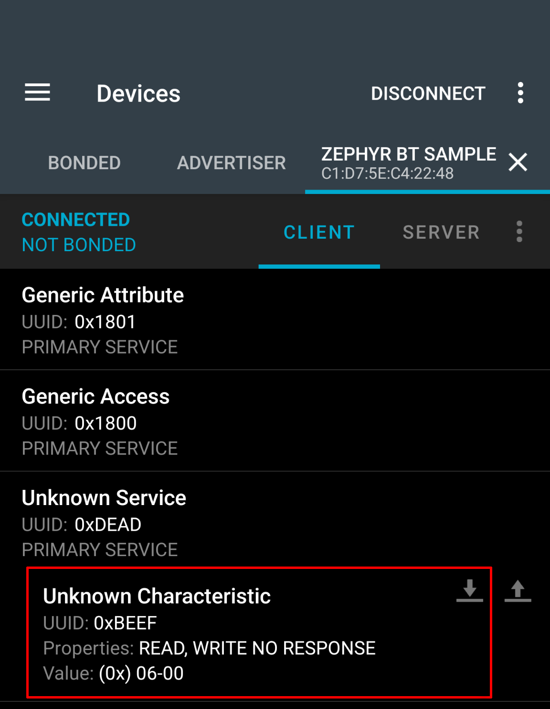
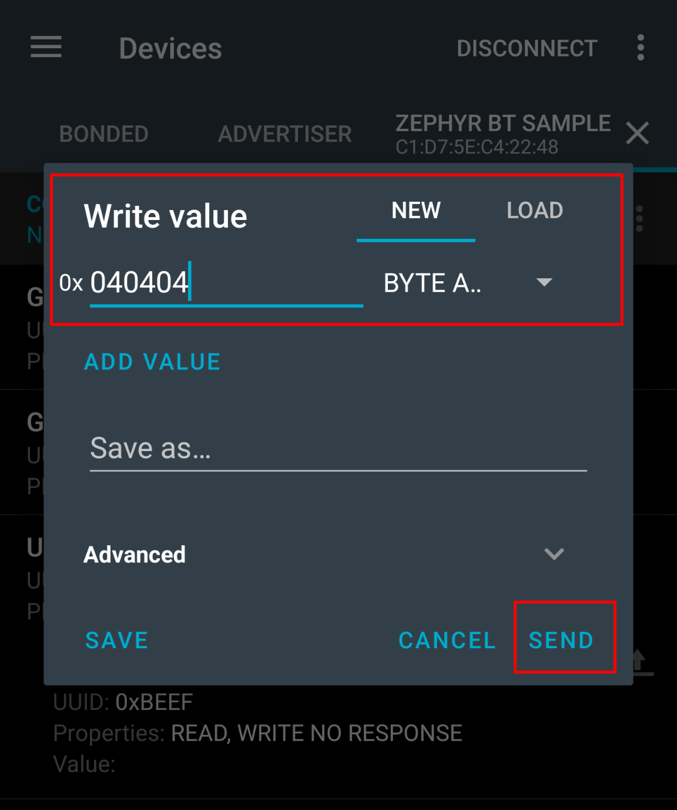

## Description
Based on the knowledge from the presentation, we will try to implement simple application using Bluetooth for Zephyr. As a hardware we will use nRF52840DK. You can read more about this devkit [here](https://www.nordicsemi.com/Products/Development-hardware/nRF52840-DK).

To interact with nRF52840, we will use nRF Connect application. It's available for android and iOS. The second one has little different look but the usage is similar. You can download the application from the [Google Store](https://play.google.com/store/apps/details?id=no.nordicsemi.android.mcp&hl=pl).

Below you will find the code divided into sections. We will explain the most important things to give you basic knowledge about implementing the simplest Bluetooth aplication. We will not use pairing, encryption or many other features. Having fundamentals you can find it at your own.

Entire code is available in `/home/devbox/Desktop/Codes/Zephyr_BLE_LAB/PROJECTS/zephyr_lab_sample` but you can also view or download it from [github](https://github.com/RadoslawSajdak/Zephyr_BLE_LAB/tree/main/PROJECTS/zephyr_lab_sample). If you can't see it, please run `git pull`.

### File structure
At the beginning, please open `zephyr_lab_sample` project inside docker (if you have any problem, please go back to the previous chapter).


The structure of our project is very simple. Looking from the bottom we have:
- **sample.yaml** - Description of the project. It's not necessary as long as you don't want to contribute to the zephyr.
- **README.rst** - Empty file. You can put the readme about your example here
- **prj.conf** - The most important file. It enables features in zephyr. Sometimes you may want to use overlays for it. You can read more about it [in the documentation](https://docs.zephyrproject.org/latest/develop/application/index.html) but it's overwhelming for me. It would be better to just look at some examples and their structure and code.
- **CMakeLists.txt** - Definition of your project. It tells the west which files you want to compile.
- **src/main.c** - Our application is very simple so we put everything into main.c

We will work with main.c only.

### Includes
Below you can find list of includes for our project. First three are required for the zephyr functions and features like queues or printk.

Fourth is specific for nRF DK and it's provided by Nordic Semiconductor. It allows to use buttons and leds on the devkit without any knowledge about devicetree. For us it's good enough but for future applications you may want to use `gpio.h` directly.

The last three allow us to use macros and functions specific to Bluetooth.

```c
#include <zephyr/kernel.h>
#include <zephyr/device.h>
#include <zephyr/devicetree.h>
#include <dk_buttons_and_leds.h>

#include <zephyr/bluetooth/bluetooth.h>
#include <zephyr/bluetooth/uuid.h>
#include <zephyr/bluetooth/gatt.h>
```

### Defines and Typedefs
To make the code more clear and user-friendly, we have defined a few macros.

`ZEPHYR_BLE_GATT_DATA_SVC_UUID16` defines the service 16-bit number whis is later extended into standard bluetooth
`0000XXXX-0000-1000-8000-00805f9b34fb` UUID.
```c
#define ZEPHYR_BLE_GATT_DATA_SVC_UUID16         (0xDEAD)
#define ZEPHYR_DATA_SVC_UUID                    0xFB, 0x34, 0x9B, 0x5F,\
                                                0x80, 0x00, 0x00, 0x80,\
                                                0x00, 0x10, 0x00, 0x00,\
                                                (ZEPHYR_BLE_GATT_DATA_SVC_UUID16 & 0xFF),\
                                                (ZEPHYR_BLE_GATT_DATA_SVC_UUID16 >> 8), 0x00, 0x00
```
Similar to the service, we have defined characteristic. Feel free to change the UUID16.
```c
#define ZEPHYR_BLE_GATT_DATA_CHRC_UUID16        (0xBEEF)
#define ZEPHYR_DATA_CHRC_UUID                   0xFB, 0x34, 0x9B, 0x5F,\
                                                0x80, 0x00, 0x00, 0x80,\
                                                0x00, 0x10, 0x00, 0x00,\
                                                (ZEPHYR_BLE_GATT_DATA_CHRC_UUID16 & (0xFF)),\
                                                (ZEPHYR_BLE_GATT_DATA_CHRC_UUID16 >> 8), 0x00, 0x00
```
Macros below will cast our bytes into structures
```c
#define BT_UUID_ZEPHYR_SVC                      BT_UUID_DECLARE_128(ZEPHYR_DATA_SVC_UUID)
#define BT_UUID_ZEPHYR_DATA                     BT_UUID_DECLARE_128(ZEPHYR_DATA_CHRC_UUID)
```
Finally we have defined type for structure of the manufacturer data payload. You can add any byte fields as far as your payload will fit the advertisement length. Attribute `__packed` is crutial to make sure the struct will not be padded. 

```c
typedef struct __packed
{
    uint16_t    vendor_id;
    uint8_t     button_state;
    uint16_t    press_count;
} manufacturer_data_adv_payload_t;
```
### Private variables
We have initalized the structure with Nordic Semiconductor ID as the first 2 bytes. It's available for every function in main but changing the value should be atomic.
```c
static manufacturer_data_adv_payload_t manuf_data_payload = {
    .vendor_id = 0x0059,
    .press_count = 0
};
```
Below you can see the definiton of our advertisement. It's constant and static. You can change only the `manuf_data_payload` but after that you MUST update the advertisement on stack.
```c
static const struct bt_data ad[] = {
    BT_DATA_BYTES(BT_DATA_FLAGS, (BT_LE_AD_GENERAL | BT_LE_AD_NO_BREDR)),
    BT_DATA_BYTES(BT_DATA_UUID16_SOME, BT_UUID_16_ENCODE(ZEPHYR_BLE_GATT_DATA_SVC_UUID16)),
    BT_DATA(BT_DATA_MANUFACTURER_DATA, (uint8_t *) &manuf_data_payload, 
            sizeof(manufacturer_data_adv_payload_t))
};
```
Entire tree of macros will define service and it's charateristic as static (so you can't unregister the services or characteristics from the server). For our example characteristic has only `write` and `read` permission without encryption. On the presentation you heard about `notifications`, `pairing` etc. and that's the place where you should define it if you need. For notifications you must add `ccc_changed` handler after every characteristics with notification.
```c
BT_GATT_SERVICE_DEFINE(bt_service, 
    BT_GATT_PRIMARY_SERVICE(BT_UUID_ZEPHYR_SVC),
        BT_GATT_CHARACTERISTIC( BT_UUID_ZEPHYR_DATA,
                                BT_GATT_CHRC_WRITE_WITHOUT_RESP | BT_GATT_CHRC_READ,
                                   BT_GATT_PERM_WRITE | BT_GATT_PERM_READ,
                                   data_tx, data_rx, NULL)
);
```
Callbacks below will be called for every connected/disconnected event. It's static so you are able to have multiple callbacks. It's useful if you have many BT_IDs.
```c
BT_CONN_CB_DEFINE(conn_callbacks) = {
    .connected = connected,
    .disconnected = disconnected
};
```
In our excercise we will use queue to save the payload from bluetooth. We want to read it byte by byte so each element of queue is 1 byte in size.
```c
K_MSGQ_DEFINE(bt_msgq, sizeof(uint8_t), 16U, 1U);
```
### Functions
We will not explain the functions here because you can look into the code and read it yourself.

### First run
Based on the previous chapter, please compile the code for nrf52840dk/nrf52840 and flash it on the devkit.

Flashing command reminder:
```bash
nrfjprog --program build/zephyr/zephyr.hex --sectoranduicrerase --verify; nrfjprog -r
```
After sucessful flash, open nRF Connect on your smartphone and tap scan (or drag the list down). You should see `Zephyr BT Sample` device. We strongly recommend that you set the High RSSI filter to filter out other students' devices.


You can connect to the device or view it's advertisement (by presing on the name). But it's doing nothing. Now you have to complete the tasks.
## Tasks
### Change the device name
`Zephyr BT Sample` name is boring and common (in this room). Change it to something different (even emoij should work :))
### User can connect to the device only once
You may notice that you can connect to your device only once. Then, after disconnect you are not able to do it because you can not find the device. It sound's like a problem with advertisement. Is it properly started after disconnect?


<pre><code class="language-c">
static void disconnected(struct bt_conn *conn, uint8_t reason)
{
    int err;
    printk("Disconnected (reason 0x%02x)\n", reason);
    (void)atomic_set(is_connected, false);

    err = bt_le_ext_adv_start(adv, BT_LE_EXT_ADV_START_DEFAULT);
    if (err)
    {
        printk("Failed to start extended advertising set (err %d)\n", err);
    }
}
</pre></code>


### Increment the press_count on falling edge
As in the title - you should implement incrementation of the `press_count` value on each falling edge of the button. The value should be updated in the advertisement so you should see it in nRF Connect. On the screenshot below I pressed the button 5 times.



<pre><code class="language-c">
static void button_changed_callback(uint32_t button_state, uint32_t has_changed)
{
    if ((has_changed & DK_BTN1_MSK) && (button_state & DK_BTN1_MSK))
    {
        manuf_data_payload.press_count++;
        adv_update();
    }
}
</pre></code>


### Read current number of presses
Reading `ZEPHYR_BLE_GATT_DATA_CHRC_UUID16` characteristic should return the value of button presses since the previous read. Each read should clear the number of presses also for the advertisement. On the screenshot below I pressed the button 6 times before read.



<pre><code class="language-c">
static ssize_t data_tx(struct bt_conn *conn, const struct bt_gatt_attr *attr, void *buf,
                         uint16_t len, uint16_t offset)
{
    printk("Reading characteristic %#04x\n", ZEPHYR_BLE_GATT_DATA_CHRC_UUID16);
    uint16_t presses_before_read = manuf_data_payload.press_count;
    manuf_data_payload.press_count=0;
    adv_update();
    return bt_gatt_attr_read(conn, attr, (void *)buf, (uint16_t)len, offset, &presses_before_read, sizeof(presses_before_read));
}
</pre></code>


### Flash the sequence after disconnect

Writing to `ZEPHYR_BLE_GATT_DATA_CHRC_UUID16` characteristic will put the bytes on the queue. You are able to write up to 16 bytes. You may implement it as you want as long as the blinking is triggered AFTER disconnect.

We have implement it little overpowered so The bytes you write are multiplied by 100ms and alternately represent the on and off times of the LED.

So eg. writing 040404 (0x04, 0x02, 0x04) will:
1) Turn the LED ON for 400ms
2) Turn the LED OFF for 200ms
3) Turn the LED ON for 400ms
4) ALWAYS after a sequence, the LED is turned off



<pre><code class="language-c">
while (1)
{
    if (false == atomic_get(is_connected))
    {
        len = k_msgq_num_used_get(&bt_msgq);
        for (int i = len; i > 0; i--)
        {
            if (0 == k_msgq_get(&bt_msgq, &msg, K_NO_WAIT))
            {
                dk_set_led(DK_LED1, i % 2 == 1);
                k_msleep(msg * 100);
            }
        }
        dk_set_led_off(DK_LED1);
    }
    k_msleep(100);
}
</pre></code>


## Useful links
https://docs.zephyrproject.org/latest/develop/west/install.html
https://docs.zephyrproject.org/latest/build/dts/index.html